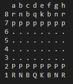

# Console Chess - How to Run & Play

## Prerequisites
- Node.js **18+** (20+ recommended)
- npm

## Run
```bash
npm install
npm run start
```

## Run Test
```bash
#run all test
npm test

#run test for specific unit test file
npm run test -- .\tests\win.test.ts
npm run test -- .\tests\board.test.ts
npm run test -- .\tests\moves.test.ts
```

## How to Play (CLI)

The program will display the board and a turn prompt:

    Console Chess ... (Ctrl+C to quit)
    White> e2,e4

## Screenshot


Enter moves in **one** of these formats:
- **Numeric (1-based):** `col,rank col,rank`
  Example: `2,5 4,5`
- **Algebraic:** `e2,e4`

If the move is legal, the board updates and the turn switches.
**The game ends** when a king is captured.

### Exit
Press **Ctrl + C**.
